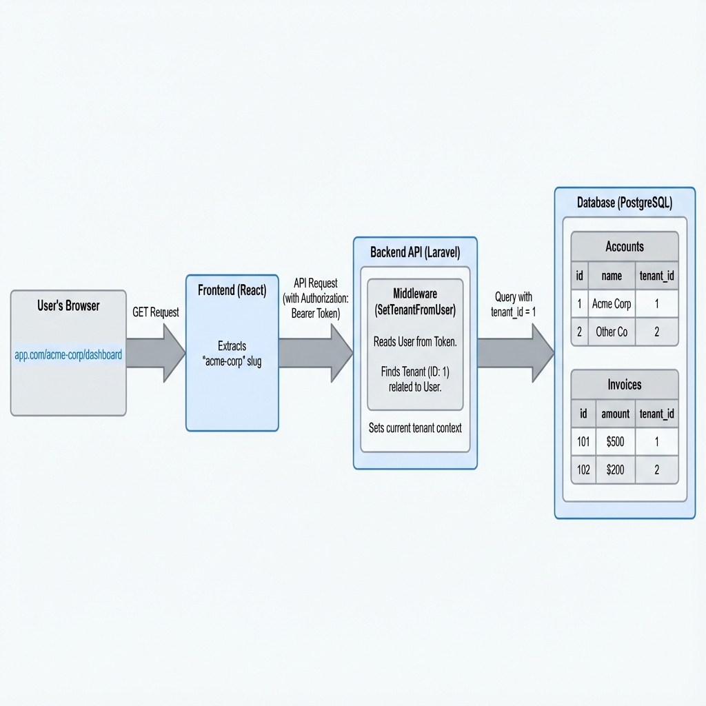

# Multi-Tenant Architecture & Logic

This document details the multi-tenant architecture implemented in AT-Book. The application uses a **Single Database, Shared Schema** approach where all tenants share the same tables, but data is strictly isolated via a `tenant_id` column and Global Scopes.

## 🏗 High-Level Architecture



1.  **Request Flow:** User accesses the app -> Frontend handles routing -> API Request with Token -> Middleware identifies Tenant -> Controller queries DB with Scope.

---

## 🔒 Tenant Resolution Logic

### 1. Frontend (URL-Based Context)
On the frontend (React), the "Current Tenant" is determined primarily by the **URL Path**.
*   **Pattern:** `/{tenant_slug}/{resource}`
*   **Example:** `http://localhost/acme-gmbh/dashboard`
*   **Logic:**
    *   `React Router` extracts the `tenant_slug` (e.g., `acme-gmbh`).
    *   This slug is used to construct API calls and navigation links.
    *   **Crucial:** All internal links must include the tenant slug to preserve context (e.g., `navigate('/' + tenant + '/invoices')`).

### 2. Backend (User-Based Context)
On the backend (Laravel), the generic "URL slug" is **NOT** trusted for security. Instead, we rely on the Authenticated User.

*   **Middleware:** `SetTenantFromUser`
*   **Mechanism:**
    1.  The request comes in with a JWT Header (`Authorization: Bearer ...`).
    2.  Laravel validates the token and retrieves the `User`.
    3.  The Middleware checks `$user->tenant_id`.
    4.  It loads the `Tenant` model and sets it as the **Global App Context** via `app()->instance('currentTenant', $tenant)`.

> **Security Note:** This ensures that even if a user manipulates the Frontend URL to `/other-company/dashboard`, the API will still only return data for the tenant belonging to their Auth Token.

---

## 🛡 Data Isolation (The `BelongsToTenant` Trait)

To prevent developers from accidentally forgetting `where('tenant_id', ...)` clauses, we use a Global Scope.

### The Trait: `App\Models\Concerns\BelongsToTenant`

Every model that belongs to a tenant (Accounts, Invoices, Contacts, etc.) uses this trait.

```php
trait BelongsToTenant
{
    protected static function bootBelongsToTenant()
    {
        // 1. Automatic Filtering
        static::addGlobalScope('tenant', function (Builder $builder) {
            if ($tenant = tenant()) { // Helper function getting context
                $builder->where('tenant_id', $tenant->id);
            }
        });

        // 2. Automatic Assignment
        static::creating(function (Model $model) {
            if (!$model->tenant_id && $tenant = tenant()) {
                $model->tenant_id = $tenant->id;
            }
        });
    }
}
```

**Result:**
*   `Account::all()` automatically becomes `select * from accounts where tenant_id = 1`.
*   `Account::create(...)` automatically sets `tenant_id = 1`.

### Uniqueness Constraints
Since multiple tenants share the same table, **Unique Columns** (like `account code` or `invoice number`) cannot be globally unique.

*   **Incorrect:** `UNIQUE(code)` -> Only one tenant in the whole world can have Account `8400`.
*   **Correct:** `UNIQUE(tenant_id, code)` -> Each tenant can have an Account `8400`.

We enforce this via **Composite Unique Constraints** in the database migration.

---

## 🔄 The "Onboarding" Flow

When a new Tenant is registered:
1.  **User & Tenant Created:** A new `User` and `Tenant` record are inserted.
2.  **Redirection:** User is sent to `/slug/onboarding`.
3.  **Account Plan Generation:**
    *   The user selects their Business Model & Legal Form.
    *   The backend (`AccountPlanController`) generates standard SKR03 accounts.
    *   **Crucial:** The controller relies on the **Composite Key** logic to allow duplicate standard codes (like `0027`, `1200`) for this new tenant, even if they exist for others.

---

## 📂 Directory Structure Highlights

*   **`app/Models/Concerns/BelongsToTenant.php`**: The core isolation logic.
*   **`app/Http/Middleware/SetTenantFromUser.php`**: Where the backend determines "Who is the current tenant?".
*   **`routes/api.php`**: All API routes are protected by the auth middleware, ensuring tenant context is always available.
*   **`resources/js/App.tsx`**: Sets up the React Router with the `/:tenant/*` wildcard route.
